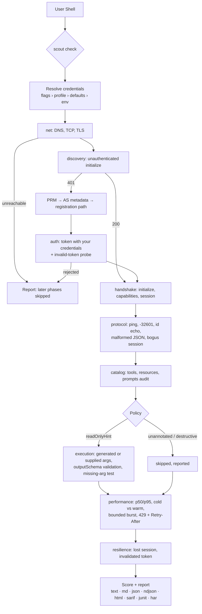

<!-- SPDX-License-Identifier: GPL-3.0-only -->

<p align="center">
  
</p>

<h1 align="center"><a id="scout"></a>scout</h1>

<p align="center">
  Test any Model Context Protocol server and find out, in plain language, whether it is ready for your agents — and exactly what to fix if it is not.
</p>

<p align="center">
  <a href="https://github.com/sebastienrousseau/scout/actions"></a>
  <a href="https://pkg.go.dev/github.com/sebastienrousseau/scout"></a>
  <a href="https://golangci-lint.run/"></a>
  <a href="https://codecov.io/gh/sebastienrousseau/scout"></a>
  <a href="https://scorecard.dev/viewer/?uri=github.com/sebastienrousseau/scout"></a>
  <a href="https://www.bestpractices.dev/projects/14698"></a>
  <a href="https://scoutmcp.io/manual/"></a>
  <a href="https://github.com/sebastienrousseau/scout/releases/latest"></a>
  <a href="LICENSE"></a>
  <a href="#requirements"></a>
</p>

---

## Contents

**Getting started**

- [Install](#install) — mise, Homebrew, Arch, Nix, Go, or from source
- [Requirements](#requirements) — the Go floor, the policy for raising it, network
- [Quick Start](#quick-start) — diagnose a server in one command
- [Servers that are programs](#servers-that-are-programs) — `--stdio`, for a server you run rather than fetch

**The scout ecosystem** (one engine, three surfaces, five satellites)

- [The scout ecosystem](#the-scout-ecosystem) — `scout`, `scout-reporting`, `scout-mcp`, `scout-action`, `scout-lsp`, `scout-census` at a glance

**Using scout**

- [Features](#features) — nine phases, real credentials, honest scoring
- [Architecture](#architecture) — end-to-end flow from first contact to report
- [The nine phases](#the-nine-phases) — what each step sends and what it looks for
- [Interactive TUI Mode](#interactive-tui-mode) — the live checklist and the tool selector
- [Credentials](#credentials) — bearer, API key, basic, client credentials, user login
- [Safety](#safety) — read-only by default, throttled, nothing adversarial
- [Understanding your report](#understanding-your-report) — the verdict, the score, what to fix
- [Scoring](#scoring) — six weighted categories, every deduction named
- [Library use](#library-use) — the public packages the CLI is built on
- [Usage & Flags](#usage--flags) — complete CLI parameter reference
- [Configuration file](#configuration-file) — defaults and profiles keyed by flag name
- [Coming from another tool](#coming-from-another-tool) — Inspector, curl scripts, playgrounds
- [Examples](#examples) — index of runnable programmatic examples
- [Troubleshooting](#troubleshooting) — quick solutions to common errors
- [Frequently Asked Questions](#frequently-asked-questions) — design decisions

**Operational**

- [When not to use scout](#when-not-to-use-scout) — honest limits
- [Development](#development) — make targets, what is generated, the site toolchain
- [Security](#security) — reporting, posture, fuzzing, supply chain
- [Documentation](#documentation) — manual, API reference, developer docs, ecosystem map
- [Stability guarantees](#stability-guarantees) — what a breaking change means here
- [License](#license)

---

## Install

### mise (macOS / Linux)

```bash
mise use -g github:sebastienrousseau/scout
```

This installs the latest released `scout` binary and keeps it managed with
the rest of your mise tools.

### Homebrew (macOS / Linux)

```bash
brew install sebastienrousseau/tap/scout
```

The tap ships a formula, so the same line works with Homebrew on Linux and
installs the manpages and completions alongside the binary. The `.deb`/`.rpm`
packages and the tarballs attached to each
[release](https://github.com/sebastienrousseau/scout/releases/latest) are the
alternatives, as are [mise](#mise-macos--linux) and the
[Go toolchain](#go-toolchain).

### Arch Linux (AUR)

```bash
yay -S scout-bin    # or: paru -S scout-bin
```

### Nix (any platform)

```sh
nix run github:sebastienrousseau/scout -- --help   # run without installing
nix profile install github:sebastienrousseau/scout # install
```

The flake ships the binary with its manpages and shell completions, and
`nix develop` gives a shell with every tool the project's CI gates need.

### Go toolchain

```bash
go install github.com/sebastienrousseau/scout/cmd/scout@latest
```

Installs into `$(go env GOPATH)/bin` (or `$GOBIN` when set). Note that a
binary built this way reports `scout version dev`: the real version is
stamped by the release pipeline through `-ldflags`, which `go install` does
not apply. Use a release artefact if you need `version` to be meaningful.

### Build from source

Requires Go 1.26.8+:

```bash
git clone https://github.com/sebastienrousseau/scout.git
cd scout
make install            # installs /usr/local/bin/scout, manpages, completions
```

`make install PREFIX=$HOME/.local` for a home-directory install.

### Platform Prerequisites

<details>
<summary><b>macOS</b></summary>

```bash
brew install go
```

</details>

<details>
<summary><b>Ubuntu / Debian / WSL2</b></summary>

```bash
sudo apt install golang
```

</details>

<details>
<summary><b>Fedora / RHEL</b></summary>

```bash
sudo dnf install golang
```

</details>

---

## Requirements

| | |
|---|---|
| **Go** | The `go` directive in [`go.mod`](go.mod) — currently **1.26.8** |
| **Network** | Outbound HTTPS to the server under test and its authorization server |

The Go floor is stated in exactly one place, `go.mod`, and CI sets
`GOTOOLCHAIN=auto` so it cannot disagree with a workflow input.

**Policy for raising it.** The floor may rise in any release when a
standard-library fix or language feature justifies it, and the reason is
recorded in that release's CHANGELOG entry. scout makes **no distro-LTS
compatibility promise** — an aspirational claim without a table mapping
distro toolchains to the floor would be worse than none. Packagers should
check `go.mod` on every version bump rather than assume the floor held.

---

## Quick Start

Point `scout check` at a server's Streamable HTTP endpoint. It runs nine
checks, shows a calm live checklist while it works, and then prints a
plain-language verdict you can read at a glance:

```bash
# An open server
scout check https://mcp.example.com/mcp

# A server that handed you a bearer token
MCP_TOKEN=… scout check https://mcp.example.com/mcp --token-env MCP_TOKEN

# A server that handed you OAuth client credentials and a tenant parameter
scout check https://mcp.example.com/mcp --auth client-credentials \
    --client-id acme --client-secret-env ACME_SECRET --param profile_id=tenant-1

# Keep everything: text, Markdown, JSON, NDJSON events and a HAR archive
scout check https://mcp.example.com/mcp --report-dir ./scout-out

# A server that is a program rather than a URL
scout check --stdio -- npx -y @modelcontextprotocol/server-everything stdio
```

A finished run reads like this:

```text
  http://mcp.example.com/mcp
  acme-mcp 1.4.0 · MCP 2025-11-25 · open, no sign-in

  Ready, with room to improve   98 / 100   Excellent

  Agents can connect to this server and use its tools. 3 things are worth
  improving, but none of them blocks adoption.

What to improve
  1  Unknown method returns -32601
     HTTP 400 instead of a JSON-RPC error
     → answer 200 with a JSON-RPC error object
  2  Tools declare outputSchema
     None declare outputSchema
     → add outputSchema and return structuredContent so results are machine-checkable
  3  Tool latency profile
     search and find_symbol take up to 17s at p95
     → slow tools make agents time out or retry; cache or bound the work

How it scores
  connectivity    ●●●●●   100
  authorization   ●●●●●   100
  protocol        ●●●●●    95
  catalog         ●●●●●    95
  execution       ●●●●●   100
  performance     ●●●●●    95
  6 of 6 areas tested
```

The headline is for anyone — a plain verdict, a score out of 100, and the
things worth fixing in order. `--verbose` adds the per-check detail for
developers; `--report-dir DIR` saves the full report and every request.

One binary, one base command, and every operation is a subcommand of it:

| Command | Does |
| :--- | :--- |
| `scout check <endpoint>` | Run all nine phases and write the scored report |
| `scout connect <endpoint>` | Only net, discovery, auth and handshake — is it reachable and do the credentials work |
| `scout tools <endpoint>` | Connect and audit the tool, resource and prompt catalog without invoking anything |
| `scout call <endpoint> <tool>` | Invoke one tool with `--arg field=value` or `--json` and time it |
| `scout login <endpoint>` | Authorize as a user in the browser (PKCE) and store the token for later runs |
| `scout attest [report.json]` | Turn a saved report into an in-toto attestation, for signing in a later job |
| `scout verify <attestation.json>` | Check an attestation offline and gate on what it says |
| `scout config init` | Write a commented configuration file listing every setting |

The exit status is 0 when nothing failed, 2 when any finding failed, and 1
on a scout error, so a pipeline can gate on it.

For a gate an organisation has to agree on rather than one pipeline, write it
down:

```sh
scout check "$URL" --policy company.json    # the policy decides the exit code
scout verify attestation.json --policy company.json
```

An acceptance policy is a reviewable file: required checks, caps on failures
and warnings, a floor on the score or on one category — and exceptions that
carry a reason, a ticket and an **expiry date**, which is the difference
between a gate a team keeps and a gate a team switches off. It is refused
rather than partly applied if it was written for a later scout, because a
policy engine that ignores what it does not understand is one that approves
things. See [Acceptance policies](https://scoutmcp.io/manual/policy/).

A run against a local server looks like this:

```text
ok    Network and TLS  [0.7ms]
      info  Endpoint uses HTTPS: plain http to loopback 127.0.0.1 (acceptable for local servers)
      ok    Hostname resolves
            1 address(es) in 0.0ms
      ok    TCP connection
            connected in 0.5ms

ok    Authorization discovery  [2.7ms]
      info  Unauthenticated initialize: 200 OK without credentials: the server is open

warn  Protocol conformance  [2.7ms]
      ok    ping
      warn  Unknown method returns -32601
            HTTP 400 instead of a JSON-RPC error
            → answer 200 with a JSON-RPC error object
      ok    Response id matches request id
…
Score
      connectivity   100.0  (weight 10)
      authorization  100.0  (weight 20)
      protocol        95.0  (weight 20)
            -5 protocol.unknown_method: HTTP 400 instead of a JSON-RPC error
      total           97.5  grade A · 6 of 6 categories assessed
```

---

## Servers that are programs

Most MCP servers are not endpoints. They are programs a host starts, talks
to over a pipe, and is responsible for stopping. Point scout at one with
`--stdio` and the command after `--`:

```bash
scout check --stdio -- npx -y @modelcontextprotocol/server-everything stdio
scout check --stdio -- uvx mcp-server-git --repository .
scout check --stdio --stdio-env GITHUB_TOKEN -- docker run -i --rm ghcr.io/example/mcp
```

scout starts the process, runs the same phases against it, and stops it
again — politely first, by closing its stdin, then by force. It is reaped on
every path out, including a cancelled run.

Three things are worth knowing before you use it.

**The server is handed almost nothing.** A stdio server is a program nobody
has audited, running as your user, on the machine where your credentials
live. It gets `PATH`, `HOME`, `TMPDIR` and the other variables a program
needs to find its interpreter — and nothing else. Not your cloud
credentials, not the tokens for three other services, not whatever the
shell you typed this into happens to export. A server that legitimately
needs one is given it by name with `--stdio-env GITHUB_TOKEN`, which is how
you say so out loud. Every run reports what it passed.

**Five checks exist only here, and one of them matters more than the
rest.** Over stdio, stdout *is* the wire: every byte on it is parsed as
protocol framing. One startup banner, one `print` left in a handler, one
progress bar, and the stream is corrupt — and what a host reports is a
hang, or a parse error naming a line nobody wrote. `stdio.stdout_clean`
names it and quotes the line. The others cover the process starting, the
process surviving the run, what it logged on stderr, and what environment
it was given.

**Two phases and five checks have no subject over a pipe, and every one of
them is reported as skipped with the reason.** Authorization discovery and
credentials do not apply: there is no origin to authorize against, so
`--token` is refused rather than quietly ignored. Four protocol probes are
about HTTP headers, and `handshake.session` is about a session a pipe does
not have. A run that silently contained fewer checks would read as a better
result than it is.

`connect`, `tools` and `call` take `--stdio` too. For `call`, the tool comes
before `--` and the server after it:

```bash
scout call --stdio get-sum --arg a=2 --arg b=3 -- npx -y @modelcontextprotocol/server-everything stdio
```

The full picture is in [the manual](https://scoutmcp.io/manual/stdio/).

## The scout ecosystem

scout is one engine with three peer surfaces, plus a family of satellites that
reach places a single binary cannot: an editor, a registry listing, a licence
that permits embedding. The table below is generated from
[`internal/ecosystem`](internal/ecosystem/family.go), so it cannot disagree
with the manifest — `make ecosystem-verify` fails the build when it does.

<!-- BEGIN generated readme family table — run `make ecosystem`; do not edit by hand -->

| Repository | Status | Licence | What it owns |
|---|---|---|---|
| **`scout`** | shipping | GPL-3.0-only | The engine, every check, and the three peer surfaces: CLI, TUI and the embedded local web UI. |
| `scout-reporting` | planned | Apache-2.0 | The report schema, the renderers, the attestation predicate and its offline verifier, plus the rubric as versioned data. |
| `scout-mcp` | planned | GPL-3.0-only | An MCP server exposing scout's diagnostics as tools, so an agent can evaluate a server from inside the editor. |
| `scout-action` | planned | Apache-2.0 | The GitHub Action wrapping the published image by digest, and a GitLab CI template. |
| `scout-lsp` | planned | Apache-2.0 | A language server over MCP artefacts — server.json, tool schemas, client configuration, scout policy and attestation files — with check-id hover from the guidance catalogue. |
| `scout-census` | planned | CC-BY-4.0 | The published reliability census: the dataset, the methodology, the disclosure log and the reproduction command. |
<!-- END generated readme family table -->

**Everything except `scout` is planned, not shipping.** They are listed because
a layout recorded before it exists cannot drift silently once it does — and so
nobody goes looking for a repository that is not there.
[`docs/ecosystem.md`](docs/ecosystem.md) carries the full entry for each,
including why it is a separate repository at all and the criterion for
archiving it, plus the three that were considered and rejected with the reasons
kept.

### Install the pieces

Only one of them exists today, which is why there is one command:

```bash
mise use -g ubi:sebastienrousseau/scout          # the engine, CLI, TUI and local web UI
```

### The three surfaces

One engine, three front ends, and the parity is enforced rather than intended —
`cmd/parity_test.go` fails the build when a flag configures a run but carries no
`RunSpec` field, because a capability reachable only through a flag is one the
other two surfaces can never have.

| Surface | Entry point | For |
|---|---|---|
| CLI | `scout check` | CI, scripts, and an exit code |
| TUI | `scout tui` | Watching a run and picking which tools to exercise |
| Web | `scout serve` | A browser on your own machine; the same run, the same report |

### The version rule

Every repository whose **Lockstep** column says yes carries the same version as
`scout`, propagated automatically on release, with a required check that blocks
a merge on disagreement. Ambiguity about which build sits behind a hosted
diagnostic is the expensive kind for a security tool. The dataset and the
language server sit outside it deliberately: a census edition is not a build of
the tool, and editor marketplaces keep their own cadence.

---

## Features

| Feature | Description |
| :--- | :--- |
| **Nine phases, in order** | Network and TLS, OAuth discovery, credentials, the initialize handshake, protocol conformance, catalog audit, safe execution with content validation, latency and concurrency, session and token recovery. |
| **Your credentials, every kind** | Bearer token, API-key headers, HTTP basic, OAuth 2.1 client credentials with extra parameters, pinned endpoints for servers without discovery, or an interactive user login with PKCE. |
| **Evidence-backed findings** | Every finding cites the requests that produced it as `req#N`, matching the `seq` in the NDJSON telemetry and the entry in the HAR file. Nothing passes without a request that showed it. |
| **Full telemetry** | DNS, connect, TLS and time-to-first-byte per request from `httptrace`, TLS version and cipher, certificate expiry, redacted headers, byte counts, JSON-RPC method and error code. |
| **Structural redaction** | Tokens, client secrets, API keys, OAuth codes and cookies are masked by name in headers, URLs, forms and JSON bodies, and a token issued during the run is masked wherever it appears afterwards. |
| **Read-only by default** | Only tools that declare `readOnlyHint` are invoked. Unannotated tools are destructive by the MCP specification's default and are skipped; mutations are an explicit opt-in. |
| **Honest scoring** | Six weighted categories, each deduction named with the finding behind it, and the report says how many categories were actually assessed. |
| **Zero configuration** | Flags cover everything; a config file with profiles is there when you test the same servers repeatedly. |

---

## Architecture

A single run builds one HTTP client whose transport is wrapped by the
telemetry recorder, then wraps it again for the MCP client with tracing,
fixed headers and the bearer transport. A second, bare transport carries
nothing but the trace header, so the requests that must arrive
unauthenticated — first contact and the invalid-token probe — really do.
Phases run in order; a phase that finds the server unreachable, or that
credentials are missing for a protected server, marks every later phase as
skipped with that reason.



Every request, whichever phase made it, passes through the same recorder,
so the report's telemetry section and the HAR file are complete by
construction.

---

## The nine phases

| Phase | What happens | Examples of findings |
| :--- | :--- | :--- |
| **net** | URL scheme, DNS, TCP, TLS handshake | plain HTTP to a public host, TLS 1.2 only, certificate expiring in 9 days |
| **discovery** | unauthenticated first contact; on 401, the challenge, RFC 9728 protected-resource metadata (hint, then path-aware and root well-known), RFC 8414/OIDC server metadata, PKCE, grants, registration path | no `WWW-Authenticate`, PRM resource differs from endpoint, S256 not advertised, no DCR or CIMD |
| **auth** | token acquisition with your credentials (static, CIMD, or dynamic registration), token shape, and whether the server rejects a made-up token | no `expires_in`, granted scope narrower than requested, **server accepts any bearer token** |
| **handshake** | `initialize`: protocol version, `serverInfo`, capabilities, instructions, session id | empty `serverInfo.version`, no capabilities declared |
| **protocol** | `ping`, unknown method, id echo, malformed JSON, invalid params, unknown tool, missing `Accept`, GET stream, bogus session id, bad protocol-version header | unknown method answered with HTTP 400, unknown session accepted |
| **catalog** | tools, resources, templates, prompts: unique names, descriptions, `inputSchema` shape, annotations, `outputSchema`, absolute URIs; capabilities vs what actually lists | 3 tools unannotated, tools listed without the capability |
| **execution** | invoke what the policy allows with generated or supplied arguments; validate `structuredContent` against `outputSchema`; omit a required argument and expect rejection; read resources; render prompts | `search` returns `hits` as a string, `lax` accepts a call with `x` missing |
| **performance** | ping baseline, repeat-call p50/p95/max per tool, cold vs warm, bounded parallel burst, 429 and `Retry-After` | p95 above 2s, errors under 4 workers |
| **resilience** | lose the session and recover, invalidate the token and recover | server ignores unknown session ids |

Run a subset with `--phases net,discovery,auth` or `--skip-phases
performance`. `scout connect` and `scout tools` are shorthands for the
connection phases and the catalog.

---

## Interactive TUI Mode

On a terminal, `scout check` shows a calm live checklist while it works —
the wordmark, the endpoint, and each of the nine checks with a spinner on
the one in flight and a plain result as it finishes:

```text
  scout
  http://mcp.example.com/mcp
  no credentials

  ✓  Connectivity    reachable over TLS   4ms
  ✓  Authorization   open server         92ms
  –  Credentials     not needed
  ✓  Handshake       acme-mcp 1.4.0      21ms
  ⠋  Protocol        checking…
  ○  Catalog
  ○  Execution
  ○  Performance
  ○  Resilience

  4 of 9 phases   ·   press q to stop
```

Press `q` at any time to stop. When the run finishes, the checklist stays
put and the report is printed below it, in your terminal's own scrollback.
There is nothing to scroll inside — it is just text you can select, copy
and page through as usual. Piped or redirected, the same run prints one
`✓ [PASS] net: 3 ok` line per check instead, so logs stay greppable.

By passing the `-i` or `--interactive` flag, you can pick the tools to
exercise before anything runs:

```bash
scout check -i https://mcp.example.com/mcp --token-env MCP_TOKEN
```

The selector connects, lists the tools with their kind (read-only,
mutating, destructive) and whether the default policy would run them, and
preselects the ones it would. Selecting a mutating or destructive tool is
an explicit opt-in for that tool only.

### Keybindings

- `[space]` — Toggle selection of the current tool.
- `[ctrl+a]` — Select all currently filtered tools.
- `[ctrl+n]` — Deselect all currently filtered tools.
- `[/]` — Enter command / filter mode.
- `[enter]` — Confirm selection and start the run.
- `[esc]` — Exit without running.

### In-Session Commands

Press `/` inside the TUI to enter Command Mode. Commands support
prefix-based autocompletion (press `[tab]` or `[right-arrow]` to
autocomplete):

- `/sort <field>` — Sort tools. Fields:
  - `name` — Alphabetical sort by tool name.
  - `kind` — Sort by kind (destructive, mutating, read-only).
  - `policy` — Sort by whether the default policy allows the tool.
  - `read-only` / `mutating` / `destructive` — Bring that kind to the top.
- `/all` — Select all filtered tools.
- `/none` — Deselect all filtered tools.
- `/exit` / `/quit` — Cancel and exit silently.
- `/help` — Display the in-session help panel overlay.

`SCOUT_SHOW_LOGO=0` replaces the flame with a plain title in both views.

---

## Credentials

Whatever you were handed, there is a flag for it, an environment variable,
and a config-profile setting with the same name.

| You were given | Use |
| :--- | :--- |
| a bearer token | `--token`, `--token-env NAME`, or `SCOUT_TOKEN` |
| an API key or tenant header | `--header "X-API-Key: …"` (repeatable) |
| a username and password | `--basic user:pass` or `SCOUT_BASIC` |
| an OAuth client id and secret | `--auth client-credentials --client-id … --client-secret-env NAME` (or `SCOUT_CLIENT_ID`, `SCOUT_CLIENT_SECRET`) |
| extra token parameters (tenant, profile, audience) | `--param key=value` (repeatable) |
| a scope | `--scope "a b"` (default: what the server's challenge asks for) |
| a token endpoint but no discovery | `--token-url … [--auth-url …] [--resource …]` |
| a hosted Client ID Metadata Document | `--client-metadata-url https://…` |
| a user login | `scout login <endpoint>` then `--auth authorization-code` |

`--auth auto` (the default) picks the mode from what is set. An explicit
`--client-id` wins over dynamic registration: an operator who was handed a
client id chose it deliberately. The report records where each credential
came from — flag, environment variable, profile — never its value.

---

## Safety

- **Read-only by default.** Only tools with `readOnlyHint: true` are
  invoked. Tools without annotations are destructive by the MCP
  specification's default and are skipped; the catalog phase warns about
  them so the server author can fix the annotations.
- **Mutations are opt-in.** `--allow-mutations` also runs tools that mutate
  but declare `destructiveHint: false`. `--allow-destructive` runs
  everything and is meant for a tenant you are willing to lose.
- **Narrow the set.** `--only NAME` and `--deny NAME` pick tools;
  `--arg tool.field=value` supplies real arguments instead of generated
  ones, and a tool given real arguments is not put through the
  missing-argument test.
- **Throttled.** Requests are capped at `--rps` (default 2). The parallel
  burst respects it unless you pass `--allow-load` to test the server's
  rate limiting for real.
- **One adversarial request.** The invalid-token probe sends a single
  request with an obviously made-up bearer token. Nothing else adversarial
  is sent, and scout has no mode that would: there are no exploit probes
  behind any flag ([ADR 0008](docs/adr/0008-no-adversarial-mode.md)).

### Safety in the other direction

Those rules protect the server. These protect you, because the server you
point scout at is by definition one you have not vetted yet.

- **Credentials are bound to the origin you named.** A bearer token, API-key
  header or HTTP basic credential is sent to that origin and nowhere else.
  A redirect leaving it is refused, not followed: an HTTP round-tripper sits
  below the redirect handler, so a client that attaches credentials without
  this check re-attaches them on every hop, and one `307` is enough to
  collect them.
- **Discovered endpoints are checked before they are contacted.** Everything
  after your own endpoint is chosen by the server: `authorization_servers`
  comes from the resource, `token_endpoint` and `registration_endpoint` from
  the authorization server, and the `resource_metadata` hint from a response
  header. Each must be HTTPS and must resolve to a public address, so a
  server cannot aim your client secret at a plaintext host or at an address
  inside the network your CI runner sits in. Loopback is always allowed, and
  an endpoint that is itself private relaxes the check for its own network.
- **The metadata must be about your endpoint.** A protected-resource
  document naming a different resource is refused: RFC 9728 requires that
  binding, and a mismatch is the shape of a token mix-up.
- **The authorization response must come from the right issuer.** The RFC
  9207 `iss` on the redirect is checked against the issuer the code was
  requested from.
- **A misbehaving server gets a finding, not a crash.** scout is tested
  against servers that misbehave on purpose — acknowledging a request with
  `202`, redirecting mid-session, streaming without end, advertising a
  schema that overflows an integer — and every one must produce a finding or
  a typed error rather than a panic, a hang, or an unbounded allocation.

---

## Understanding your report

Every run answers one question first: **is this server ready for agents?**

- **Ready for agents** — everything works. Ship it.
- **Ready, with room to improve** — agents can use it today; the listed
  items make it better, none blocks adoption.
- **Not ready for agents** — an agent will hit a real problem here. Fix
  the numbered items before you roll it out to your fleet.
- **Couldn't finish the check** — scout could not reach or sign in to the
  server. The one thing to fix is shown; nothing else was tested.

The **score out of 100** is a weighted read across six areas —
connectivity, authorization, protocol, catalog, execution and performance.
The five-dot meter beside each area shows where the points went. Only areas
that were actually tested count, and the report says how many, so a high
score on a partial run can't be mistaken for a clean bill of health.

**What to improve** lists each issue as a plain problem and a one-line fix,
worst first. That is the whole executive summary. Developers add
`--verbose` for the per-check detail: every check, the tools and resources
that were called, the speed measurements, and a `req#N` reference tying
each finding to a recorded request.

### Formats and telemetry

`--output text` (the default, coloured on a terminal) prints the report
above to your terminal's scrollback, so you scroll it the normal way.
`--output md` is a shareable Markdown document, `--output json` the full
structured report (add `--events` to embed every request), and
`--output ndjson` a stream you can pipe into `jq`.

Two formats exist for machines that will not read anything else:
`--output sarif` is SARIF 2.1.0 for GitHub code scanning — every rule
carries the check's documentation link — and `--output junit` is JUnit XML,
so a run lands beside the unit tests in your CI panel. Neither is richer
than `json`; each is the same findings in the shape one reader insists on.

`--output attestation` is not a report at all. It is an in-toto statement — a
claim about the server in the envelope a supply-chain pipeline already
verifies, meant to be signed and handed to a machine that was not present
when the run happened. It states what it was judged against, carries a
verdict for every check rather than only the failures, and verifies offline,
because a gateway must never have to call scout to trust something scout
produced.

```sh
scout check "$URL" --output json > report.json   # where the credentials are
scout attest report.json > attestation.json      # where the identity is
scout verify attestation.json --endpoint "$URL" --require auth.unauthenticated_tools --max-fail 0
```

`scout verify` answers whether the statement can be believed; the gates are
what turn that into approval, and each is opt-in. Exit 0 means every gate
met, 2 means the evidence is good and the answer is no, and 1 means the
evidence is unusable — a gateway should treat the last two as different
incidents. See [Reports and telemetry](https://scoutmcp.io/manual/reports/#attestations).

`--report-dir DIR` writes all of them plus:

- `telemetry.ndjson`, one line per request: phase, label, method, URL,
  status, DNS/connect/TLS/TTFB/total timings, TLS version and cipher,
  certificate expiry, redacted headers, byte counts, JSON-RPC method and
  error, and with `--capture-bodies` the redacted bodies.
- `telemetry.har`, the same as an HTTP Archive 1.2 you can open in any
  browser's devtools.

Findings cite requests as `req#N`; `N` is the `seq` field in the NDJSON
and the entry index in the HAR.

Redaction is structural, not best-effort: `Authorization`, cookies and
key-like headers are masked by name; `code`, `state`, `client_secret` and
friends are masked in URLs and forms; `access_token`, `refresh_token`,
`client_secret` and similar are masked inside JSON bodies and their values
registered, so a token issued mid-run is masked wherever it appears
afterwards. Content types are not trusted — a body that starts with `{` is
treated as JSON, because token endpoints answer `text/plain` often enough.

---

## Scoring

Six categories, weighted: connectivity 10, authorization 20, protocol 20,
catalog 15, execution 20, performance 15. Each starts at 100; a critical
failure zeroes it, a major one costs 40, a minor one 15, and every warning
5. The total is the weighted mean over the categories whose phases actually
ran, and the report says how many that was, so a partial run cannot pass
for a full one. Every deduction is listed with the finding that caused it.

Grades are coarse labels for dashboards: A at 90 and above, B at 75, C at
60, D at 40, F below.

---

## Library use

The CLI is built on public packages you can use directly:

```go
client, _ := scout.New(scout.Config{
    Endpoint: "https://mcp.example.com/mcp",
    Auth:     scout.AuthConfig{Mode: scout.AuthClientCredentials, Extra: url.Values{"profile_id": {"t1"}}},
})
res, err := client.Connect(ctx)      // 401 → discovery → registration → token → initialize
tools, _ := client.ListTools(ctx)
out, _ := client.CallTool(ctx, "search", map[string]any{"q": "invoices"})
```

`auth` exposes discovery, registration and the token sources individually;
`transport` is the Streamable HTTP layer with raw access for conformance
probes; `diagnostics` holds the safety policy, the schema-driven argument
generator, the validator and a standalone read-only runner; `trace` carries
the run's trace id.

---

## Usage & Flags

### Positional Arguments

```bash
scout check <endpoint>
scout check --stdio -- <command> [args...]
```

- `<endpoint>` — The server's Streamable HTTP URL (Required, unless
  `--profile` supplies it, or `--stdio` names a program instead).
- `<command> [args...]` — With `--stdio`, the program to run as the server.
  Everything after `--` belongs to it, including its own flags. It is
  executed as named: there is no shell, so nothing is expanded or split.

### Target Options

| Option | Default | Description |
| :--- | :--- | :--- |
| `--stdio` | `false` | The server is a program to run, given after `--`, rather than a URL |
| `--stdio-dir` | — | Working directory for the server process |
| `--stdio-env` | — | Forward this environment variable to the server by name (repeatable) |
| `--stdio-set` | — | Set a variable as `NAME=value` (repeatable; replaces the forwarded set entirely) |

### Credential Options

| Option | Default | Description |
| :--- | :--- | :--- |
| `--auth` | `auto` | Credential mode: `auto`, `none`, `bearer`, `client-credentials`, `authorization-code` |
| `--token` | — | Pre-issued bearer token (or `SCOUT_TOKEN`) |
| `--token-env` | — | Read the bearer token from this environment variable |
| `--header` | — | Extra header sent on every request, `"Name: value"` (repeatable) |
| `--basic` | — | HTTP basic credentials as `user:password` (or `SCOUT_BASIC`) |
| `--client-id` | — | OAuth client id (or `SCOUT_CLIENT_ID`) |
| `--client-secret` | — | OAuth client secret (or `SCOUT_CLIENT_SECRET`; prefer `--client-secret-env`) |
| `--client-secret-env` | — | Read the client secret from this environment variable |
| `--client-metadata-url` | — | `https` URL of a Client ID Metadata Document to use as client id |
| `--scope` | — | Scope to request (default: what the server challenge asks for) |
| `--param` | — | Extra token/authorization request parameter `key=value` (repeatable) |
| `--token-url` | — | Token endpoint, bypassing discovery |
| `--auth-url` | — | Authorization endpoint, bypassing discovery (with `--token-url`) |
| `--resource` | — | RFC 8707 resource indicator override |
| `--redirect-port` | `8976` | Loopback port for the authorization-code redirect |
| `--token-auth-method` | — | Token endpoint auth: `client_secret_basic`, `client_secret_post` or `none` |

### Policy Options

| Option | Default | Description |
| :--- | :--- | :--- |
| `--policy` | — | Judge the run against this acceptance policy file instead of the default "any failure fails" rule |
| `--allow-mutations` | off | Also invoke tools that mutate but are not destructive |
| `--allow-destructive` | off | Also invoke destructive and unannotated tools (dangerous) |
| `--only` | — | Restrict execution to this tool (repeatable) |
| `--deny` | — | Never invoke this tool (repeatable) |
| `--arg` | — | Argument override `tool.field=value` (repeatable; JSON parsed when possible) |
| `--insecure-allow-http-auth` | off | Allow a discovered OAuth endpoint served over plain `http` |
| `--insecure-allow-private-hosts` | off | Allow a discovered OAuth endpoint that resolves inside your network |
| `--allow-resource-mismatch` | off | Continue when the protected-resource metadata names a different endpoint |

The three overrides above each switch off a check that exists because
everything past your own endpoint is chosen by the server under test. Leave
them off unless you know why you are turning one on; see
[Safety](#safety).

### Pacing Options

| Option | Default | Description |
| :--- | :--- | :--- |
| `--samples` | `5` | Repeat calls per tool in the performance phase |
| `--concurrency` | `4` | Workers in the parallel burst (`0` disables) |
| `--rps` | `2` | Max requests per second; `0` or negative disables throttling |
| `--timeout` | `30s` | Per-call timeout |
| `--seed` | `1` | Seed for generated arguments |
| `--fill-optional` | off | Also populate optional schema properties |
| `--allow-load` | off | Run the burst unthrottled to test the server's rate limiting |
| `--max-resources` | `25` | Max resources to read |
| `--max-prompts` | `25` | Max prompts to render |

### Output Options

| Option | Short | Default | Description |
| :--- | :--- | :--- | :--- |
| `--interactive` | `-i` | off | Pick the tools to exercise in the selector before the run |
| `--output` | — | `text` | Output format: `text`, `json`, `md`, `ndjson`, `html`, `sarif`, `junit`, `attestation` |
| `--report-dir` | — | — | Write `report.{txt,md,json,html,sarif,junit.xml}`, `attestation.json`, `telemetry.ndjson` and `telemetry.har` here |
| `--otlp-endpoint` | — | — | Export the finished run as OpenTelemetry traces to an OTLP/HTTP collector |
| `--otlp-header` | — | — | Extra header on the OTLP export, `Name: value` (repeatable) |
| `--log-format` | — | `human` | Diagnostic format on stderr: `human` or `json` |
| `--capture-bodies` | — | off | Record request/response bodies in telemetry (redacted, capped) |
| `--events` | — | off | Embed every telemetry event in JSON output |
| `--guidance` | — | off | Embed remediation for each finding in JSON output, keyed by check id |
| `--verbose` | `-v` | off | Show evidence references and full info findings |
| `--no-color` | — | off | Disable ANSI colour |
| `--phases` | — | all | Run only these phases (comma-separated) |
| `--skip-phases` | — | — | Skip these phases (comma-separated) |
| `--config` | — | `~/.config/scout/config.json` | Configuration file |
| `--profile` | — | — | Profile from the configuration file supplying the endpoint and settings |
| `--log-level` | — | `info` | Diagnostic verbosity on stderr: `error`, `warn`, `info`, `debug` |

### Diagnostics

Results go to stdout in the format `--output` selects. Diagnostics — which
phase is running, what failed, why something was skipped — go to stderr, so
`--output json` stays pipeable no matter how noisy the run is.

`--log-level` controls how much of that stderr you get. `SCOUT_LOG_LEVEL`
sets the same thing for a whole shell session. `SCOUT_SHOW_LOGO=0` drops
the flame from the selector and `version`.

```bash
# Why was that tool skipped? Turn the detail up.
scout check https://mcp.example.com/mcp --log-level debug

# Machine-readable results, quiet stderr, both at once.
scout check https://mcp.example.com/mcp --output json --log-level error > report.json

# For a bug report: full detail, everything captured.
SCOUT_LOG_LEVEL=debug scout check https://mcp.example.com/mcp --report-dir ./out 2> diagnostics.log
```

### Operational Commands

```bash
scout connect https://mcp.example.com/mcp --token-env MCP_TOKEN
scout tools https://mcp.example.com/mcp --output md
scout call https://mcp.example.com/mcp search --arg q=invoices --arg limit=5
scout login https://mcp.example.com/mcp
scout config validate
```

`connect` stops after the handshake, `tools` after the catalog audit,
`call` invokes one tool and prints its result with timing, and `login`
runs the PKCE flow and stores the token (0600) under
`~/.config/scout/tokens.json` for `--auth authorization-code` runs.

---

## Configuration file

`~/.config/scout/config.json` (or `$XDG_CONFIG_HOME/scout/config.json`, or
`SCOUT_CONFIG`). Keys are flag names, so the file has no schema of its own
and picks up new flags automatically. `scout config init` writes a
commented template listing every setting.

```json
{
  "defaults": { "rps": 4, "report-dir": "./scout-reports" },
  "profiles": {
    "prod": {
      "endpoint": "https://mcp.example.com/mcp",
      "settings": {
        "auth": "client-credentials",
        "client-id": "acme",
        "client-secret-env": "ACME_SECRET",
        "param": ["profile_id=tenant-1"],
        "deny": ["send_email"]
      }
    }
  }
}
```

```bash
scout check --profile prod
```

Precedence, highest first: an explicit flag, the selected profile, the
defaults block, the flag's built-in default. Environment variables are
consulted for secrets only. Keep secrets in the environment and reference
them with the `*-env` settings. A setting that names no flag is an error,
not a silent no-op.

---

## Coming from another tool

Migration guides live in [`docs/migrating/`](docs/migrating/README.md):
from [MCP Inspector](docs/migrating/from-mcp-inspector.md), from
[a curl script](docs/migrating/from-a-curl-script.md), or from
[an online playground](docs/migrating/from-an-online-playground.md).

Each says what carries over, what is genuinely different, and what scout
will not do — nothing there touches the server, and `scout connect` shows
you the handshake before anything else runs.

---

## Examples

To inspect the package layout and programmatically drive scout modules,
see the self-contained, copy-pasteable Go code examples in the
[examples](examples/) directory:

1. **[Connect and call](examples/connect_and_call.go)** — Connect with
   OAuth client credentials through the public `scout` and `auth` packages
   and invoke one tool.
2. **[Safe diagnostics](examples/safe_diagnostics.go)** — Run the
   library's read-only `diagnostics` runner against an open server and
   print the quality score with its deductions.

---

## Troubleshooting

| Error Message | Cause | Solution |
| :--- | :--- | :--- |
| `server requires authorization and no credentials were supplied` | The server answered 401 and `--auth` resolved to `none`. | Pass `--token-env`, `--client-id`/`--client-secret-env`, or run `scout login`. |
| `--auth client-credentials needs --client-id` | Client-credentials mode with nothing to identify the client. | Supply `--client-id`, `--client-metadata-url`, or `SCOUT_CLIENT_ID`. |
| `token endpoint invalid_target` | The authorization server rejected the RFC 8707 resource indicator. | Pass `--resource` with the value the server expects. |
| `no stored token for this endpoint` | `--auth authorization-code` without a prior login. | Run `scout login <endpoint>` first. |
| `credentials rejected at initialize` | The token was issued but the MCP server did not accept it. | Check audience/resource, scope and expiry; `--log-level debug` shows the challenge. |
| `unknown setting "rsp"` | A config key does not match any flag name. | Settings are named after flags; see `scout check --help`. |

---

## Frequently Asked Questions

- **Does it test stdio servers?**  
  No. scout speaks Streamable HTTP. Put a stdio-to-HTTP bridge in front of
  a stdio server, or run it in HTTP mode if it has one.
- **Why were my tools skipped?**  
  They declare no annotations, or `destructiveHint` is true. The MCP
  specification's default for an unannotated tool is destructive, and scout
  honours it. Add `readOnlyHint: true` to the tools that are, or opt in with
  `--allow-mutations` / `--allow-destructive` on a tenant you control.
- **Why did a tool return `isError` and count as a warning, not a failure?**  
  Generated arguments are representative, not real; a server that rejects
  `"probe"` as a repository name is behaving correctly. Give it real values
  with `--arg tool.field=value` and the call becomes a proper test.
- **Can I run it inside cron or CI?**  
  Yes. The command is non-interactive, stdout carries the report in the
  format you chose, and the exit status is 2 when any finding failed.
- **Where do the secrets go?**  
  Nowhere. They are registered with the redactor before the first request
  and masked in every event, body and report. The token store is written
  with mode 0600, and a store that is readable by anyone else is refused
  rather than read.
- **Can a server under test steal my token?**  
  Not by asking for it. Credentials are bound to the origin you named, so a
  redirect pointing somewhere else is refused rather than followed, and the
  OAuth endpoints a server advertises are checked for HTTPS and for pointing
  at a public host before scout will talk to them. That is what
  `--insecure-allow-http-auth` and `--insecure-allow-private-hosts` turn
  off, which is why they say `insecure`.
- **Are the `*_ms` fields in the JSON milliseconds?**  
  Yes. `scout.schema_version` in the report says which format version you
  are reading; pin it if you build on the JSON.

---

**THE ARCHITECT** ᛫ [Sebastien Rousseau](https://sebastienrousseau.com)  
**THE ENGINE** ᛞ [EUXIS](https://euxis.co) ᛫ Enterprise Unified Execution Intelligence System

---

## When not to use scout

scout is opinionated, and the opinions do not suit everyone.

- **You want a load test.** The parallel burst is bounded on purpose, and
  the default throttle is two requests per second. Use a load-testing tool
  for capacity questions; use scout to learn whether the server behaves
  under modest concurrency and rate-limits politely.
- **You need full JSON Schema validation.** The validator covers the
  structural core — types, required, properties, items, enum, const,
  bounds, oneOf/anyOf/allOf — and resolves local `$ref`/`$defs` pointers,
  which is what pydantic, zod and the official SDKs emit. It does not fetch
  a `$ref` that points at another document (it reports one as unchecked
  rather than passing it over), and it does not check `pattern` or `format`.
  A contract that leans on those needs a full validator.
- **Your server is stdio-only.** scout tests the Streamable HTTP
  transport. A bridge can expose a stdio server over HTTP, but the
  transport findings then describe the bridge.
- **You need the Tasks or Apps extensions checked.** scout diagnoses the
  core protocol on both the handshake revisions and the stateless
  `2026-07-28` one, but it does not yet exercise the optional extensions.
- **You want an agent to exercise the server.** scout's execution phase is
  deterministic: generated or supplied arguments, one call per tool. The
  `diagnostics.Model` interface exists for a model-driven probe, but no
  vendor adapter ships in this module.
  adversarial mode, by decision rather than by omission
  ([ADR 0008](docs/adr/0008-no-adversarial-mode.md)). Use dedicated security
- **You need Windows without WSL.** Binaries are published for Windows,
  but the experience is less tested than on macOS and Linux.

---

## Development

```bash
make              # format, vet, lint, spdx, examples, ecosystem, ssg, test, race, build
make test         # go test ./...
make test-race    # -race -shuffle=on -count=1
make lint         # golangci-lint at zero warnings
make coverage     # coverage against the stated gate
make bench        # benchmarks, smoke-run and asserted on nothing
make checks       # regenerate docs/checks.md from the call sites
make ecosystem    # regenerate the family map from internal/ecosystem
make ssg-check    # every page comes from ssg and the theme suite
make commitlint   # AGENTS.md section 4 on the commits this branch adds
make docs         # manpages and shell completions from the cobra definitions
make site         # the marketing site, via ssg
make web-shell    # the embedded application shell, via ssg
make sbom         # CycloneDX bill of materials
make api-check    # API breakage against the last release
make fuzz         # every fuzz target, with the committed corpus replayed
```

[`DEVELOPMENT.md`](DEVELOPMENT.md) reproduces every CI gate locally, one command
per gate, and is the single entry point for a new contributor.

### What is generated, and never edited by hand

Five things in this repository are derived, and editing the output instead of
the source is the mistake the gates exist to catch:

| Output | Source | Gate |
|---|---|---|
| `docs/checks.md` | the `(*Session).check(id, title)` call sites | `make checks-verify` |
| `docs/ecosystem.md`, `ecosystem.json`, the table above | `internal/ecosystem` | `make ecosystem-verify` |
| `internal/web/dist/` | `web/content` + `web/_layouts`, via `ssg` | `make ssg-check` compares a hash of the inputs against `internal/web/shell.sources` |
| manpages, completions | the cobra command definitions | `make docs` |
| the published check count, wherever it is published | the same call sites | `make checks-verify` |

The embedded shell is the one that needed a real gate rather than an
existence check. It is committed because `go:embed` needs it at compile time,
nothing regenerates it automatically, and a stale one builds perfectly — so
it shipped the wrong check count three times before `make web-shell` started
recording what it was built from.

That last gate exists because the embedded shell once shipped advertising a
figure the source had long since left behind: a rebuild is something a person
has to remember, and this is what happens when they do not.

### The website and the application shell

Both are built with [`ssg`](https://static-site-generator.com/) from the
**Scout theme** in the [SSG theme suite](https://github.com/sebastienrousseau/ssg-themes.github.io),
which supplies the WCAG AAA colour tokens, the dark mode, the severity ledger,
the evidence tables and the print stylesheet that turns a report into a PDF.
The layouts are vendored under `web/_layouts` and `site/_layouts` on purpose,
so the site builds in CI with nothing but the `ssg` binary: a product site that
needs a second repository checked out to build is a product site that breaks
the week nobody is looking.

There is no second toolchain and no hand-written page — `make ssg-check`
enforces both. Design changes belong upstream in the theme, not in a local fork
of it; the differences that exist today are each declared with a reason in
[`internal/ecosystem/sites.go`](internal/ecosystem/sites.go).

---

## Security

**Reporting.** Do not open a public issue. Follow the private process in
[SECURITY.md](SECURITY.md); the response SLA is stated there.

**Posture.** scout runs with credentials the operator supplied against
servers the operator chose, so the threat model is about *limiting blast
radius*, not crossing a privilege boundary. Full detail in
[docs/security-model.md](docs/security-model.md).

- **Secrets are redacted at the recorder, structurally.** Headers by name,
  URL and form parameters by name, JSON keys by name with their values
  registered, so nothing that was ever a secret reaches a report, a log or
  a HAR file. The token store is written with mode 0600.
- **Nothing destructive without a flag.** Only `readOnlyHint` tools run by
  default; unannotated tools are treated as destructive per the
  specification; mutations and destructive tools each need their own
  opt-in.
- **One adversarial request, and throttled.** The invalid-token probe is
  the only request designed to be rejected. Everything is capped at
  `--rps` unless `--allow-load` is given.
- **Unauthenticated probes are really unauthenticated.** A second, bare
  transport carries no credentials of any kind, so a server that accepts
  any token cannot hide behind the real one.
- **Memory safety** comes from Go; there is no CGO anywhere
  (`CGO_ENABLED=0`), so released binaries are static and free of libc
  coupling.

**Fuzzing.** Fuzz targets cover the parsing boundaries — the
`WWW-Authenticate` challenge parser, the SSE response reader, the JSON
Schema validator and the argument generator. A committed seed corpus under
each package's `testdata/fuzz/` replays on every `go test`, and the targets
run for a fixed duration on every push. scout is not enrolled in OSS-Fuzz.

**Supply chain.** Releases are signed with keyless cosign, carry SLSA build
provenance and a CycloneDX SBOM, and are built with `-trimpath` so two
builds of a commit are byte-identical. Every GitHub Action is pinned by
commit SHA and the container base by digest. `govulncheck` runs on every
push.

---

## Documentation

The four entry points, identical across every repo in the family:

- **[User Manual](https://scoutmcp.io/manual/)** — the rendered manual: getting started, credentials, the nine phases, reports, configuration
- **[API reference](https://pkg.go.dev/github.com/sebastienrousseau/scout)** — the Go packages the CLI is built on
- **[Developer docs](DEVELOPMENT.md)** — toolchain, task map, reproducing every CI gate locally
- **[Ecosystem map](docs/ecosystem.md)** — the surfaces, the published artefacts, the lockstep version rule

| Document | Covers |
|---|---|
| [`docs/architecture.md`](docs/architecture.md) | How a run is put together: the engine, the phases, the transports |
| [`docs/checks.md`](docs/checks.md) | Every check scout runs, generated from the source and gated in CI |
| [`docs/adr/`](docs/adr/) | Decision records for the choices that get questioned later |
| [`docs/security-model.md`](docs/security-model.md) | Threat model, the credential boundary, what scout will and will not send |
| [`docs/packaging.md`](docs/packaging.md) | Addressed to distribution maintainers: licence grant, toolchain policy, offline tests |
| [`pkg/VERIFY.md`](pkg/VERIFY.md) | Verifying a release: checksums, keyless cosign identity, SBOM |
| [`SECURITY.md`](SECURITY.md) | Disclosure policy, supported versions, response SLA |
| [`CONTRIBUTING.md`](CONTRIBUTING.md) | Signed-commit and DCO policy, PR guidelines, the local test recipe |
| [`CHANGELOG.md`](CHANGELOG.md) | Per-release notes following Keep a Changelog 1.1.0 |
| [`SUPPORT.md`](SUPPORT.md) | Where to ask, and what to expect |

Once installed, `man scout` works offline, and every subcommand has its own
page (`man scout-check`).

---

## Stability guarantees

scout is pre-1.0 and follows SemVer, with the patch digit moving for
everything until 1.0.

**The breaking axis is behaviour, not signatures.** For a tool whose output
is consumed by pipelines and whose requests reach other people's servers, a
change to what it *sends* or *reports* is breaking even when no flag or
function signature moves. Specifically, these are treated as breaking:

- A change to what `--output json` / `ndjson` emits, beyond added fields
- A change to a finding id, or to the status a given observation produces
- A change to the score weights or deductions
- A change to an exit code
- A safety refusal becoming permissive: any case where scout used to
  decline to invoke a tool and now proceeds
- A new request that reaches the server under test without a flag to
  disable it

Added fields, new flags with inert defaults, new findings, and new refusals
are **not** breaking.

**Deprecation window.** A deprecated flag keeps working for at least one
minor release after the release that announces it, and warns on stderr —
never on stdout, which carries the selected output format.

---

## License

Licensed under the **[GNU General Public License v3.0](LICENSE)**.

<p align="right"><a href="#scout">Back to Top</a></p>
